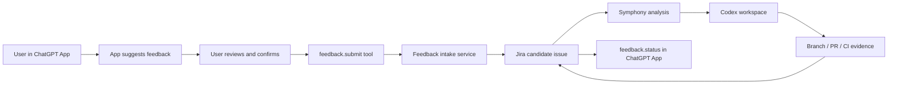

# Feedback To Symphony Loop

Status: concept / roadmap extension

This document describes the target feedback loop between a ChatGPT App, Jira Cloud, Symphony, and
Codex. The first target app is a VaDa SmartHouse ChatGPT App, but the pattern should stay reusable
for other apps that want a privacy-first path from user feedback to implementation work.

## Goal

Let a user give structured feedback from inside a ChatGPT App and turn that feedback into a safe,
traceable work candidate for Symphony.

The desired loop is:



## Core Principle

The app may suggest that the user sends feedback when the conversation shows friction, but it must
not silently create work, upload conversation context, or start implementation.

Every conversion from app feedback to tracker work requires:

- visible user intent;
- editable feedback summary;
- explicit confirmation;
- minimal context;
- traceable intake ID;
- clear status back to the user.

This keeps the loop useful without making the app feel like hidden telemetry.

## ChatGPT App Shape

The first implementation can be a small widget. The production target is an interactive, decoupled
ChatGPT App pattern:

- an MCP server defines the tools and owns auth, validation, and writes;
- a widget renders the feedback UI inside ChatGPT;
- data tools return structured content that the model and widget can reuse;
- render tools attach UI resources;
- the model can suggest the feedback action, but the user confirms before mutation.

This follows the current Apps SDK model where a ChatGPT App is built from an MCP server, optional UI
resources, and model-selected tools.

Design references:

- Apps SDK MCP server guide: <https://developers.openai.com/apps-sdk/build/mcp-server>
- Apps SDK tool planning guide: <https://developers.openai.com/apps-sdk/plan/tools>

## Tool Template

Use the app-facing name "Feedback" for users, but keep the internal tool surface small and explicit.

### `feedback.open`

Use this when the user appears blocked, dissatisfied, or explicitly asks to report a problem or
suggest an improvement.

Type: render tool

Behavior:

- prepares a draft feedback summary;
- opens the feedback widget;
- does not create Jira issues;
- does not send private context outside the app server.

### `feedback.submit`

Use this when the user has reviewed the feedback draft and explicitly confirms they want to send it
to the product workflow.

Type: mutating data tool

Behavior:

- validates user confirmation;
- redacts obvious secrets and private identifiers;
- creates or updates a feedback intake record;
- optionally creates a Jira issue with a configured label such as `symphony-feedback`;
- returns a stable feedback ID and optional Jira issue key.

Suggested input fields:

```text
source_app
user_goal
observed_problem
expected_behavior
feedback_type
severity
conversation_summary
reproduction_steps
user_confirmed
context_reviewed
idempotency_key
```

Suggested `feedback_type` values:

```text
bug
improvement
missing_capability
confusing_response
automation_request
other
```

### `feedback.status`

Use this when the user asks what happened to feedback they already submitted.

Type: read-only data tool

Behavior:

- returns intake status;
- returns Jira issue key when available;
- returns Symphony decision when available;
- never exposes internal logs, private workspace paths, secrets, or unrelated Jira data.

Suggested statuses:

```text
received
needs_clarification
triaged
duplicate
out_of_scope
accepted_for_work
running
pr_created
ready_for_review
completed
declined
```

## Symphony Decision Gate

Feedback should not automatically become code execution. Symphony should classify and gate it first.

Possible decisions:

- `needs_clarification`: ask the user or maintainer for missing detail.
- `duplicate`: link to existing issue or feedback.
- `out_of_scope`: keep a record, but do not run.
- `manual_review`: sensitive, risky, broad, or unclear; human triage required.
- `accepted_for_work`: safe, narrow, reproducible, and inside configured scope.

Only `accepted_for_work` can become an implementation run.

## Privacy And Trust Rules

- Prefer suggested feedback over silent automation.
- Do not send full conversations by default.
- Show the generated feedback summary before submission.
- Let the user edit or remove context before submission.
- Do not collect screenshots, attachments, logs, or device details unless explicitly requested and
  confirmed.
- Do not store private ChatGPT conversation IDs in public fixtures or docs.
- Keep all examples synthetic.
- Redact secrets before writing comments, logs, Jira issues, or Symphony workpads.
- Make user-facing status honest: "received" is not "implemented".

## Jira Integration

For the first real pilot, feedback can become Jira issues in a dedicated project or through a
dedicated label in the same sandbox project.

Recommended fields:

- issue type: task or feedback;
- label: `symphony-feedback`;
- source app: `vada-smarthouse-chatgpt-app`;
- feedback ID;
- severity;
- feedback type;
- user-reviewed summary;
- reproduction steps;
- Symphony decision status.

Jira remains the human-visible control plane. The ChatGPT App is an intake surface, not the source of
truth for implementation state.

## Roadmap

### Phase 5A: Feedback Intake Specification

- Define tool schemas and status model.
- Document privacy and consent behavior.
- Add a local fake intake adapter for tests.
- Add sanitized fixtures.

### Phase 5B: Jira Feedback Intake

- Create Jira issues from confirmed feedback.
- Add idempotency keys to avoid duplicate issues from retries.
- Add `feedback.status` backed by Jira issue metadata.
- Keep all writes behind ENV-configured Jira credentials and project allowlists.

### Phase 6: Symphony Feedback Analysis

- Deduplicate feedback.
- Classify bug/improvement/support/out-of-scope.
- Estimate implementation scope and risk.
- Decide whether human review is required.

### Phase 7: Controlled Implementation Runs

- Launch Symphony only for accepted, narrow, in-scope feedback.
- Create a branch and PR through the normal GitHub workflow.
- Report PR and CI evidence back to Jira.

### Phase 8: ChatGPT App Status Loop

- Let the ChatGPT App show feedback status.
- Link completed work to release notes or review notes.
- Ask the user to validate whether the change addressed the original feedback.

## Non-Goals

- Silent telemetry.
- Automatic implementation without user confirmation.
- Full conversation upload by default.
- Replacing Jira as the work control plane.
- Replacing human review, CI, or deployment approval.
- Public app-store submission before the internal pilot is stable.

## Open Questions

- Should feedback create Jira issues immediately, or first create a lightweight intake record?
- Which fields should be visible to the user before submission?
- Which feedback categories can ever auto-run without maintainer approval?
- How should duplicate feedback be merged while keeping users informed?
- What status should the ChatGPT App show when a PR exists but has not shipped?
